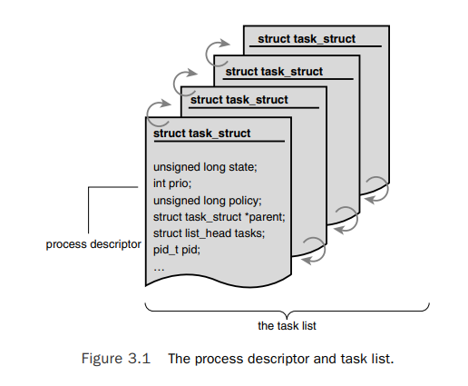

## Section 2: Process Management

### What is a process?

A process is the set of resources used by an executing program. This includes resources such as:

- **Open files and pending signals** (i.e. I/O)
  - In Linux, most resources are stored as files, meaning we can interact with them using the system calls including:
    - `int fputc( int c, FILE *fp )` - Writes the char `c` to the file stream `fp`
    - `int fputs( char *s, FILE *fp )` - Writes the char array `*s` to the file stream `fp`
    - `int fgetc( FILE *fp)` - Reads a char `c` from the file stream `fp`
    - `int fgets( char *s, int size, FILE *fp)` - Reads at most `size` chars from the file string `fp` into the char array `*s`
  - Signals help faciliate control of execution and the process state. There are a large number of *standard signals* that the kernel defines. These can be found in the [man pages](https://man7.org/linux/man-pages/man7/signal.7.html) under `Standard Signals`
- **Internal kernel data**
  - The main point of having a kernel is to manage userspace processes. As will be seen shortly, in order to manage processes (and threads), the kernel needs to store data about them 
- **Processor state**
  - The processor has several registers and memory locations that it uses in order to execute the current instruction including
    - **Program Counter (PC)** - Provides the address of the next instruction to be executed
    - **Registers** - Contains small amount of data that may be used in intermediate calculations
    - more!!
- **Memory address space**
  - A memory address space is a space in virtual memory that is available for a process to use
  - Memory address spaces can have multiple memory mappings (e. many processes have access to the same memory address space). A memory space of a given process is accessable by all its threads
  - with different segments in the virtual memory address space
    - ***text segment*** - this is the address space of a process which contains the executable instructions of the process
    - ***data segment*** - this is the address space of a process which contains static variables (i.e. variables which span the lifetime of the program)
    - ***bss segment*** - this is the address space of a process which contains static variables that have been declared but **not** been initialized
    - ***stack segment*** - this is the address space of a process that contains stack structures where each frame pushed or popped holds a state of the function. Each thread has its own stack inside the stack segment to ensure that their flow execution is independent. The information stored on the state of the process is dependent on the OS, but usually contains
      - local variables
      - parameter arguments
      - return address
      - return value address (i.e. where to store)
    - ***heap segment*** - this is the address space of a process that contains dynamically allocated memory which is shared by all threads and shared libraries / dll. Unlike *stack* memory, this isn't garbage collected meaning that the programmer has to allocate and deallocate memory (to avoid leaks)

### Creating processes

**TODO**: Add code examples

### Process Descriptor and the Task Structure

Another name for a process is a **task**. These tend to be used interchangablly, and internally, the Linux kernel refers to processes as tasks.

The kernel stores the set of all processes in a circular doubly linked list called the **task list**. Each element in the task list, is a **process descriptor** of the type `struct task_struct` which is defined in `<linux/sched.h>` header file. This struct stores all the information that the linux kernel needs to know about the process to manage it.

In the first section, we defined what a process was - It is a set of resources that an executing program uses. The `struct task_struct` stores all the neccessary information about these resources including open files, processes's address space, pending signals, processor state, and much more.

**Hint**: Take a look at the `<linux/sched.h>` file to look at what other information is stored in the `struct task_struct`.

### Allocating the process descriptor

Each userspace thread has two stacks:
- User Stack - this is used to store stack frames that correspond to instructions that are executed in userspace. This is stored in the user address space
- Kernel Stack - When the thread makes a syscall to execute a privileged action in kernelspace, this stack is used. This is stored in the kernel address space

The `task_struct` structure is allocated by the `slab allocator`, which is a memory management mechanism for efficient allocation of objects.

In > Linux 2.7, a `struct thread_info` structure is allocated at the end of the kernel stack which holds information about the thread including a pointer to the corresponding `task_struct` that can contain multiple threads (and therefore multiple `struct thread_info`)

In < Linux 2.7, this wasn't the case, and the `struct thread_info` structure did not exist

### Storing the process descriptor

The system identifies processes by the unique `pid` (process ID) which is a nnumerical value represented by the opaque type `pid_t`. This is typically a signed short int (32bit) for the sake of backwards compatability with earlier Unix/Linux versions.

Since each process needs to have a unique PID, the max number of PIDs available effectively limits the number of processes that can be allocated (32,768). In some cases, this may be an insufficient number of processes for large servers/systems. We can modify <linux/threads.h> before compiling linux in order to increase this size.

PIDs are allocated in contiguously increasing order. Therefore the notion that processes with larger PIDs are newer than processes with smaller PIDs. However, once the max PID number is used, the system then wraps around to 0 and finds the next smallest PID available.

**NOTE**: The reason why `pid_t` is signed is so that negative values can be returned from syscalls such as `fork()` to denote errors. However, the process ID's themselves cannot be negative, which is why the max number of processes is 2^(intsize - 1)

Inside the kernel, tasks (`struct task_struct`) are typically referenced directly by pointers (as opposed to using the task list). This is done to avoid wasted computations of searching the the task list for a process descriptor.

In order to get the process descriptor about the currently executing task, the kernel provides the `current` macro. This macro is architecture specific:
- some architectures may store a pointer to the current process descriptor (`task_struct`) in a register, 
- other architectures don't do this so need to calculate the memory address of the process descriptor every time the macro `current` is used

In x86 architecture, the `current` macro needs to calculate the memory address of the process descriptor:
1. It starts by calculated the address of the `struct thread_info` that is stored in the currently used stack. This is performed in assembly by the `current_thread_info()` method.
  - `movl $-8192, $eax` - it stores the negative of the size of the stack. In this case the size of the stack is 8192 bytes
  - `andl $esp, $eax` - It then masks out the least significant bits by anding the stacking pointer (stored in `$esp`), with the size of the kernel stack (stored in `$eax`)
  - This returns a pointer to the `struct thread_info` structure. The reason why we use a negative value here is because in x86, the stack grows downwards
2. The `struct thread_info` stores a pointer to its corresponding `struct task_struct`, and dereferences that to get the data stored in that struct

In other architectrures such as PowerPC (IBM's RISC-based microprocessor), the current `task_struct` address is stored in the register `r2` meaning that the macro `current` just reads from this. The reason this can be done in PowerPC is because it has plenty of registers, and its kernel develoeprs deemed the address to the current `task_struct` worthy of a process register
