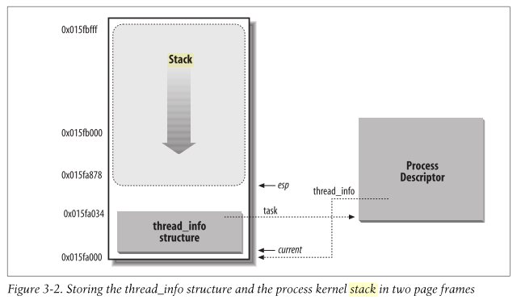

## Section 2: Process Management

### What is a process

A process is a running instance of a program, which uses resources such as the following:

- **Open files and pending signals** (i.e. I/O)
  - In Linux, most resources are stored as files, meaning we can interact with them using the system calls including:
    - `int fputc( int c, FILE *fp )` - Writes the char `c` to the file stream `fp`
    - `int fputs( char *s, FILE *fp )` - Writes the char array `*s` to the file stream `fp`
    - `int fgetc( FILE *fp)` - Reads a char `c` from the file stream `fp`
    - `int fgets( char *s, int size, FILE *fp)` - Reads at most `size` chars from the file string `fp` into the char array `*s`
  - Signals help faciliate control of execution and the process state. There are a large number of *standard signals* that the kernel defines. These can be found in the [man pages](https://man7.org/linux/man-pages/man7/signal.7.html) under `Standard Signals`
- **Internal kernel data**
  - The main point of having a kernel is to manage userspace processes. As will be seen shortly, in order to manage processes (and threads), the kernel needs to store data about them 
- **Processor state**
  - The processor has several registers and memory locations that it uses in order to execute the current instruction including
    - **Program Counter (PC)** - Provides the address of the next instruction to be executed
    - **Registers** - Contains small amount of data that may be used in intermediate calculations
    - more!!
- **Process address space**
  - A process address space is a space in virtual memory address space that is available for a process to use
  - Memory address spaces can have multiple memory mappings (i.e. many processes have access to the same memory address space). A memory address space of a given process is accessable by all its threads
  - The process address space is broken down into different segments that are used for different types of data:
    - ***text segment*** - this is the address space of a process which contains the executable instructions of the process
    - ***data segment*** - this is the address space of a process which contains static variables (i.e. variables which span the lifetime of the program)
    - ***bss segment*** - this is the address space of a process which contains static variables that have been declared but **not** been initialized
    - ***stack segment*** - this is the address space of a process that contains stack structures to represent the process's current function call stack. Each frame in this stack holds the state of a function that is currently being executed (or which has called another function). The top of the stack is the most recently called function. Each thread has its own stack inside the stack segment to ensure that their execution flows are independent. The information stored on the state of the process is dependent on the OS, but usually contains:
      - local variables
      - parameter arguments
      - return address
      - return value address (i.e. where to store)
    - ***heap segment*** - this is the address space of a process that contains dynamically allocated memory which is shared by all threads and shared libraries / dll. Unlike *stack* memory, this isn't garbage collected meaning that the programmer has to allocate and deallocate memory (to avoid leaks)


### Process Descriptor and the Task Structure

Another name for a process in the Linux Kernel is a **task**. These tend to be used interchangablly, and internally, the Linux kernel refers to processes as tasks.

The kernel stores the set of all processes in a circular doubly linked list called the **task list**. Each element in the task list, is a **process/task descriptor** of the type `struct task_struct` which is defined in `<linux/sched.h>` header file. This struct stores all the information that the linux kernel needs to know about the process to manage it.

In the first section, we defined what a process was - It is a set of resources that an executing program uses. The `struct task_struct` stores all the neccessary information about these resources including open files, processes's address space, pending signals, processor state, and much more.

**Hint**: Take a look at the [`<linux/sched.h>`](https://github.com/torvalds/linux/blob/master/include/linux/sched.h) file to look at what other information is stored in the `struct task_struct`.


### Allocating the process descriptor

Each userspace thread has two stacks:
- User Stack - this is used to store stack frames that correspond to instructions that are executed in userspace. This is stored in the user address space
- Kernel Stack - When a userspace thread makes a system call to execute a privileged action in kernelspace, this stack is used. This is stored in the kernel address space

The `task_struct` structure is allocated by the `slab allocator`, which is a memory management mechanism for efficient allocation of objects.

In > Linux 2.7, a `struct thread_info` structure is allocated at the end of the kernel stack which holds information about the userspace thread including a pointer to the corresponding `task_struct` that can contain multiple threads (and therefore multiple `struct thread_info`). This structure is lightweight and is used because the slab allocator is used to allocate `struct task_struct` instances. We will discuss slab allocators way down the line, so come back here when you are ready.

In < Linux 2.7, this wasn't the case, and the `struct thread_info` structure did not exist

The `struct thread_info` structure is defined on x86 architecture in [`<asm/thread_info.h>`](https://github.com/torvalds/linux/blob/master/arch/x86/include/asm/thread_info.h). Here's the Linux 2.7 version:

```
struct thread_info {
  struct task_struct *task;
  struct exec_domain *exec_domain;
  __u32 flags;
  __u32 status;
  __u32 cpu;
  int preempt_count;
  mm_segment_t addr_limit;
  struct restart_block restart_block;
  void *sysenter_return;
  int uaccess_err;
};

```


### Storing the process descriptor

The system identifies processes by the unique `pid` (process ID) which is a numerical value represented by the opaque type `pid_t`. This is typically a signed short int (32bit) for the sake of backwards compatability with earlier Unix/Linux versions.

Since each process needs to have a unique PID, the max number of PIDs available effectively limits the number of processes that can be allocated (32,768). In some cases, this may be an insufficient number of processes for large servers/systems. We can modify [`<linux/threads.h>`](https://github.com/torvalds/linux/blob/master/include/linux/threads.h) before compiling linux in order to increase this size.

PIDs are allocated in contiguously increasing order. Therefore a notion does exist that processes with larger PIDs are newer than processes with smaller PIDs. However, once the max PID number is used, the system then wraps around to 0 and finds the next smallest PID available, which breaks this notion.

**NOTE**: The reason why `pid_t` is signed is so that negative values can be returned from syscalls such as `fork()` to indicate errors. However, the process ID's themselves cannot be negative, which is why the max number of processes is 2^(intsize - 1)

Inside the kernel, tasks (`struct task_struct`) are typically referenced directly by pointers (as opposed to using the task list). This is done to avoid wasted computations of searching the task list for a process descriptor.

In order to get the process descriptor about the currently executing task, the kernel provides the `current` macro. This macro is architecture specific:
- some architectures may store a pointer to the current process descriptor (`struct task_struct`) in a register, 
- other architectures don't do this so need to calculate the memory address of the process descriptor every time the `current` macro is used

In the x86 architecture, the `current` macro needs to calculate the memory address of the process descriptor:
1. It starts by calculated the address of the `struct thread_info` that is stored in the currently used stack. The assembly that the `current_thread_info()` method is shown here:
  - `movl $-8192, $eax` - it stores the negative of the size of the stack. In this case the size of the stack is 8192 bytes
  - `andl $esp, $eax` - It then masks out the least significant bits by performing a bitwise and with the stack pointer address (stored in `$esp`), with the size of the kernel stack (stored in `$eax`)
  - This returns a pointer to the `struct thread_info` structure which resides at the bottom of the kernel stack space on architectures where the stack grows downwards. The reason why we use a negative value here is because in x86, the stack grows downwards.
2. The `struct thread_info` stores a pointer to its corresponding `struct task_struct`. The `current` macro dereferences the `task` member of the `struct thread_info` to get this `struct task_struct` instance:
  - `current_thread_info()->task;`

In other architectrures such as PowerPC (IBM's RISC-based microprocessor), the current `task_struct` address is stored in the register `r2` meaning that the macro `current` just reads from this. The reason this can be done in PowerPC is because it has plenty of registers, and its kernel develoeprs deemed the address to the current `task_struct` worthy of a process register

The kernel stack:



### Process State

A process descriptor (`struct task_struct`) has a field called `state` which defines the current state of the process. Every process on the system must have exactly one of five states:
- `TASK_RUNNING` - The task is runnable - it is either currently running or in a run queue. This is the only possible state for a process executing in user-space; it can also apply to a process in kernel-space that is actively running
- `TASK_INTERRUPTABLE` - The task is currently sleeping (i.e. blocked) and is waiting for some condition to exist. When this condition exists, the kernel will set the process descriptor's state to `TASK_RUNNING`. Alternatively, if a signal is received, then the kernel awakes the task prematurely, by setting its state to `TASK_RUNNING`
- `TASK_UNINTERRUPTABLE` - In some cases,  we may want tasks to be able to sleep until some condition exists, **without** being able to be prematurely worken up by a signal. This is used a lot less than `TASK_INTERRUPTABLE` as this behavior is usually not wanted in most cases. This is why you have unkillable processes some time (since the process will not respond to signals while in this state).
- `__TASK_TRACED` - The process is being `traced` by another process (e.g. a debugger using `ptrace`)
- `__TASK_STOPPED` - The task is no longer runnable. Its execution has stopped and it is not eligible to run any more. This occurs after a task receives the signals `SIGSTOP`, `SIGTSTP`, `SIGTTIN`, `SIGTTOU` or if it receives *any* signal while it is being debugged


The set of process states can be modelled by a FSM, which can be seen in the diagram below:


### Manipulating the current process state

The Kernel will often need to change the state of processes using the macro `set_task_state(task, state)` defined in [`<linux/sched.h>`](https://github.com/torvalds/linux/edit/master/include/linux/sched.h).

On SMP systems, it also provides a memory barrier to enforce ordering of other process's execution. Memory barriers are also used to enforce consistency to avoid unexpected behavior from out-of-order execution. Here are some more resources on memory barriers and memory ordering:
- https://preshing.com/20120710/memory-barriers-are-like-source-control-operations/
- https://preshing.com/20120625/memory-ordering-at-compile-time/
- https://preshing.com/20120930/weak-vs-strong-memory-models/

The method `set_task_state(task, state)` is equivalent to `set_current_state(state)`. If you'd like to see more of these macros and functions, view the [`<linux/sched.h>`](https://github.com/torvalds/linux/edit/master/include/linux/sched.h) header file.


### Process Context

One of the most important parts of a process is the executing program code. The corresponding executable is read from secondary storage and loaded into the process's address space. 

Processes typically execute in `user-space`. However when a process requires to execute a privileged action that can only be performed in `kernel-space`, the kernel then executes those actions on behalf of the userspace task in the `kernel-space`. The kernel is said to be in **process context** when it is executing intructions on behalf of the user-space process.

Once the kernel finishes executing the process in process context, the process may either resume in `user-space`, or if there is a higher priority process that is runable, then the kernels schedules pre-empts the current process and executes the higher-priority one. **NOTE**: The `current` macro is only usable in `kernel-space`.

The kernel has two well defined interfaces that userspace tasks can interact with - these are system calls and exception handlers. A process can only be executed in `kernel-space` if it uses a kernel interface.

### Process Family Tree

In Unix systems, there is a hierarchical structure that all processes adhere to, and linux is no different. When the linux system boots up, the first process that is executed is the `init` process (which has PID 1).

The `init` process is the parent of all Linux processes. If you take a look back at the task descriptors (`struct task_struct`), it has a member called `ppid` (parent PID). Every task has a parent, and the set of tasks on a system can be visualized as a tree (where tasks can have siblings, parents, and children). The root of the tree is the `init` process, which is the only task to not have a parent process.

The `init` process's job is to initialize the system by triggering additional processes on startup in order to complete the boot process. Historically, `init` would execute `initscripts` that could be found at `etc/inittab` although I believe that this has been phased out for rcS scripts. (**TODO**: Find whether this is true!!!)

The `init` task's process descriptor is statically allocated as `init_task`. This makes sense as the `init` process lives until the OS shuts down. Between bootup and shutdown, the `init` process cannot be killed (and can only be requested to be at shutdown - It is up to the `init` process to shut itself down at this point).

**Hint**: Take a look at Page 30 on "Linux Kernel Development by Robert Love" to see code examples regarding the traversal of processes

### Process Creation

Most Operating systems tend to implement a *spawn* mechanism that
1. Creates a new process in a new memory address space
2. Reads in an executable and begins execution

However, Unix differs in that it performs these two operations as **separate distinct** system calls:
1. `fork()` - it creates a copy of the current task where the only difference is the PID, PPID, memory address space, pending signals and I/O, and certain resources and statistics
2. `exec()` - Reads the executable from storage and loads it into the address space and begins executing it
**NOTE**: There are numerous variants of each of these that are described later

The combination of performing `fork` followed by `exec` is similar to a single `spawn` function that most other OSs provide. 

#### Copy On Write

Historically, when `fork()` was executed, all resources owned by the parent were duplicated and the copies were given to the child. However, this is pretty **inefficient** for two reasons:
1. There will likely be duplicated resources that could otherwise be shared (e.g. read-only resources)
2. In the scenario where we want to perform `exec` to load a **different** executable, then the Kernel wouldn't have wasted CPU on duplicating resources for a child task that will **not** use them and will have to be overwritten again due to the call to `exec`.

Nowadays, `fork()`'s implementation uses **Copy-On-Write pages** in order to reduce wasted memory and computation. When a `fork()` call is executed:
1. The child is allocated its own process address space
2. The child copies the parent's page table
3. Each of the parent resources are shared with the child (i.e. the child will access resources stored in the parent's process addres space)
4. The child and parent share resources as long as no operations have modified the shared resources/values since the fork occured
5. Once a write operation is to occur on a shared resource, the resource is duplicated so that the parent and child have their **own** copies (and I believe at this point, the child modifies its page table)

This technique delays duplication of pages from the parent's memory address until it is written to. In the case where `exec()` is called immediately after `fork()` none of the resources are duplicated, to reduce wasted computations. This is a considerable optimization that improves quick process execution.

The only incurred overhead by `fork()` is:
1. The duplication of the parent's page tables (so that the child has a way to map virtual address to physical addresses for the resoures it shares with the parent)
2. The creation of the unique process descriptor for the child.

#### Forking

There are a variety of fork methods that can be used that modify the behavior of the child and parent, or resources shared between the parent and children. The two main system calls for forking are `fork()` and `vfork()`, which both invoke the `clone()` system call.

The `clone()` system call can take a set of parameters that specify which resources are shared betwen the parent and child, (as well as the behavior of the cloning of the process). The `fork()` and `vfork()` methods don't have any arguments, but call the `clone()` with a set of constant arguments that define their documented behavior (which we will be defined shortly)

The `clone()` syscall calls yet another syscall called `do_fork()` which performs the majority of the forking work, and can be found  in `kernel/linux.c`. This function calls`copy_process()`, and then continues execution of the program.

The interesting work is done by the `copy_process()` function:
1. **Duplicates the parent's task related structures by calling `dup_task_struct()`** - A new kernel stack, `thread_info` struct, and task_struct are created for the child process which have identical values to the parent. The task descriptors for child and parent at this point are identical
2. **Checks if child exceeds resource limits** - There are resource limits in place such as process number limits on a per-user basis, that cannot be exceeded
3. **Clears/Reinitializes members of the child `task_struct`** - A lot of the members of `task_struct` should not be inherited by the child. This includes usage and statistics information.
4. **Sets the child process's status to `TASK_UNINTERUPTABLE`** - This ensures that no signals interfer with the process causing it to prematurely run
5. **Updates the flags of the child `task_struct` by calling `copy_flags()`** - Flags such as `PF_SUPERPRIV` (which states if a task has used sudo privileges), and `PF_FORKNOEXEC` (which denotes whether a task has called `exec()`), are cleared and set respectively
6. **Allocates a new PID to child by calling `alloc_pid()`**
7. **Duplicates/Shares resources depending on `clone()` arguments** - Depending on what arguments where passed to clone, resources such as open files, filesystem information, signal handlers, process memory addresses, and namespaces are either shared or duplicated. This is the stage that will semantically different processes and threads.
8. **Cleanup is performed and a pointer to the child `task_struct` is returned**

#### vfork()

`vfork()` is another way to create a child process. However, it behaves different from `fork()` in a few ways:
- When `vfork()` is called, **nothing** is duplicated for the child process. The child is the sole process running in the parent's memory address space. The child has **read-only** access and cannot modify anything in the address space
- When `vfork()` is called the parent is blocked until the child exits or the child calls `exec()`

Historically, `fork()` was not implemented using Copy-On-Write principles, so there was more cpu and memory wastage. `vfork()` was introduced during this time when `fork()` didn't use CoW. Therefore it was a welcome addition, as it reduced the wastage caused from:
1. Duplicating parent resources, eventhough a later `exec()` call would allocate and overwrite the `task_struct` entries that pointed to these resources
2. Duplicating *all* parent resources, eventhough the child and parent will likely share only a subset of those resources throughout their lifecycle

However, with the implementation of `fork()` using CoW, the only benefits gained from `vfork()` is the memory/cpu saved from copying resource duplicating the parent's page tables. The semantics of `vfork()` can be sometimes tricky.

`vfork()` follows the same workflow of calling `clone()` which in turn calls `do_fork()` like we saw previously for `fork()`. However, this `vfork()` syscall is implemented by passing a special flag to the `clone()` syscall.

Here is some of the behavior of `do_fork()` which diverges from `fork()` for `vfork()`:
1. During the `copy_process()` the `task_struct.vfork_done` member is set to null
2. Later on, the `task_struct.vfork_done` is pointed to a specific address (where ?)
3. After the child starts running, the parent is blocked until the child signals it through the `vfork_done` pointer
4. During the release of memory address ,(which is done when a task exist a memory address space by calling `mm_release()` syscall), the `task_struct.vfork_done` is checked. If `vfork_done` is not NULL then the parent is signalled
5. Back in `do_fork()` the parent wakes up and returns (a pointer to the child's `task_struct`?)

Assuming the `vfork()` call was successful, the child is executing in a new address space, and the parent is executing again in its original address space. Although the overhead is lower, the implementation isn't pretty. It's important to note that between the initial call to `vfork()` and the call to `exec()`, the child process is not allowed to write to the parent's address space.


### Linux Implementation of Threads

Threads are a popular programming abstraction that allow for multiple threads of exuection within the same process in a shared memory addres space. Additionally, they can share resources such as open files and signals. Threads enable *concurrent programming* and on multiprocessor system, *true parallelism*

The Linux Kernel has a unique implementation of threads. There is no concept of a thread, and threads are constructed as standard processes and described in the same way (e.g. using `task_struct`). The Kernel doesn't provide any special scheduling semantics or data structures to represent the thread. Instead, threads just happen to share resources such as address spaces with other processes.

In other Operating Systems such as Windows or Solaris, their kernels have explicit support for threads which are a different construct from processes. In these types of systems, threads are sometimes called **lightweight** processes as threads are meant to be an abstraction that provides a lighter and quicker exuection until than a heavy process

However, in Linux, threads are essentially processes that happen to share s set of resources with each other (e.g. memory address space, open files, etc.). In Linux threads and process both have `task_structs` in the same task list. The threads are children of the parent parent process, and the threads are setup to share certain resources from the parent process.

#### Creating Threads

Linux threads can be created using the call to the syscall `clone()` (which `fork()` and `vfork()` also use). The `clone()` syscall parameters define how the task cloning process behaves and what resources are shared between the parent and child task. We can create a child thread using the following sytemcall:

`clone(child_func, child_stack, CLONE_VM | CLONE_FS | CLONE_FILES | CLONE_SIGHAND, 0)`

The first argument is a function pointer that is executed by the created child thread. It has type of `int (*fn)(void *)`

The second argument is the newly allocated stack for the child thread. It has type of `void *child_stack`

The third argument is a bitmask that we create by performing bitwise OR operation on the above flags:
- `CLONE_VM` 
  - If this flag is set, then the child and parent task run in the same memory address space (i.e. the parent's process address space). Any memory writes performed by one task is visible to the other. This extends to memory mappings, where any calls to `mmap()` or `munmap()` by one task is visible by the other.
  - If this flag is not set, the child task runs on a copy of the parent process's memory space, and memory map operations by the parent or child are not visible to each other.
- `CLONE_FS`
  - If this flag is set, then the child and parent share the same filesystem information. This includes the root directory (i.e. including changes via `chroot()`), current working directory (i.e. including changes via `chdir()`), and the default user file-creation permissions known as *umask* (i.e. including changes via `umask()`)
  - If this flag is not set, the child process works on a copy of the filesystem information at the time of the `clone()` call. Future calls to `chroot()`, `chdr()`, and `umask()` by the parent or child are not visible to the other.
- `CLONE_FILES`
  - If this flag is set, then the child and parent share the same file descriptor table (and therefore have the same access permissions to the same set of file descriptors (e.g. open files, sockets)). Any creation, modification, or deletion of file descriptors by one process affect the other.
  - If this flag is not set, then the child task inherit a copy of the parent's file descriptor table, and any future operations by the parent or child do not affect the other. It's important to note, that the child also copies the file offsets (e.g. what offset inside the file will read/write operations be called at), and file status flags (e.g. what permissions if the file opened with - rwx).
- `CLONE_SIGHAND`
  - If this flag is set, then the child and parent share the same signal handler table. Any changes by the child or parent to the behavior associated using `sigaction()` are shared. The child inherits a copy of the signal mask from the parent, but can modify it without modifying the parent's signal mask. This means that the two tasks can choose to listen/block their own desired set of signals. Additionally parent and child tasks will have distinct sets of pending signals.
  - If this flag is not set, then the child task inherits a copy of the signal handlers from the parent at the time of the `clone()` call, and all future calls to `sigaction()` by either task make no impact on the other

I'm not exactly sure what the fourth argument is (parent tid? wouldn't make sense - surely this should be allocated automatically)

The `fork()` syscall executes `clone()` using the following bitmask: `SIGCHLD` (only one argument is passed so there is no bitwise OR operation performed)
  - If the `SIGCHLD` flag is set, the child task will send a `SIGCHLD` signal to the parent when the child stops of terminates. The default behavior is to ignore this signal. This signal can be caught and the child task's exit status can be retrieved immediately by calling `wait()`

The `vfork()` syscall executes `clone()` using the following bitmask: `CLONE_VFORK | CLONE_VM | SIGCHLD`
  - If the `CLONE_VFORK` flag is set, the execution of the calling task is susspended until the child releases its virtual memory resources via a call to `execve()` or `_exit()`. If the flag is not set, then both the child and parent are schedulable after the `clone()` call, and an application should not rely on task execution being ordered in any particular order
  - The `CLONE_VM` and `SIGCHLD` flags have been discussed above

The full configurable behavior of the `clone()` syscall is defined in its man pages [here](https://man7.org/linux/man-pages/man2/clone.2.html)


#### Kernel Threads

The kernel has background operations that it wishes to schedule including cleanup operations such as flush operations (e.g. `flush`) or interrupt handler operations (`ksoftirqd`). The Linux kernel uses the same task abstraction and system (e.g. `struct task_struct`) as userspace processes. These tasks are commonly called **kernel threads*** or **kernel tasks**. The main difference between kernel and userspace tasks is that kernel tasks do not have an address space. This can be seen by the fact that the `task_struct->mm` attribute which typically stores a `struct` that describes the task's process memory space, is instead set to `NULL` for kernel threads. Kernel threads only work in kernelspace and do not context switch into user-space. It's important to note that Kernel threads are still pre-emptible and schedulible.

Kernel tasks follow the same notion as userspace tasks, that they are forked from a parent task. However, unlike userspace tasks, all kernel threads are forked from a root kernel task, which means the kernel process relationship tree would have a max depth of 1. This root kernel task is called `kthreadd` (kernel thread daemon) which is created at bootup and essentially acts as an interface for the kernel to dynamically create kernel threads (a.k.a. `kthreads`). The `kthreadd` task has a PID of 2.

The Linux Kernel Development book shows how to create and run kthreads on Page 36. The important part are the function declarations for creating a kernel task.

The below declaration is used to only create a new kthread (and not to execute it):

`struct task_struct *kthread_create(int (*threadfn)(void * data), void *data, const char namefmt[], ...)`

A few things to note here:
- `kthread_create()` returns a pointer to a `struct task_struct*` - This enforces the notion that kernel and normal tasks use the same core data structures to track them.
- `int (*threadfn)(void *data)` is a function pointer to be executed in the child kthread
- `void *data` is a uncasted pointer to the data that will be passed to the function that the child kthread will execute
- `const char namefmt[]` is a printf-style string that uses variable arguments from the `kthread_create` function (i.e. `, ...`) to create a name that is assigned to the child task
- This task is set in an unrnabble state so that it will not be prematurely executed while executing the `kthread_create` function or until the kernel code decides when to initate it's execution via the `wake_up_process(struct task_struct *)` function

A macro exists that creates **and** immediately runs a kthread:

`#define kthread_run(threadfn, data, namefmt, ...)`

The kthread can be stopped in a few methods:
- Allow the kthread to continue execution until it executes a `do_exit()`. This could be explicity in the function that is passed as a pointer in `kthread_create()`, but I assume that the kernel will probably wrap this function such that once the function exists, there is a `do_exit()` call.
- Alternatively, the kernel (or a kthread) can execute the function `int kthread_stop(struct task_struct*)` to stop a specific kthread that corresponds to the `task_struct` passed

### Process Termination

 When a process dies, the kernel releases the resources owned by the process and notifies the child's parent of its termination. The process can terminate either when:
 - The process calls the `exit()` syscall either explicitly by instructions associated with the program's user-code, or implicitly by instructions that get executed after the user-code has been executed (e.g. a C compiler will place a `exit()` call after the `main()` function has returned).
 - The process receives a signal that it cannot handle or an exception it cannot ignore (Involuntary Termination).

 The majority of work executed by `exit()` occurs in the `do_exit()` function which is also used in the task termination process. It generally does the following
 - **Sets the task descriptor to an 'exiting state'** - The `PF_EXITING` flag is set in the `task_struct.flags` attribute
 - **Deletes Kernel Timers** - Calls `del_timer_sync()` to remove any kernel timers. This guarantees that there are no kernel timer in a queue and that not timer handlers are running.
 - **(Optional) Updates BSD Accounting Information** - If BSD account is enabled, a call to `acct_update_integrals()` is executed to writeup accounting information
 - **Releases struct mm_struct** - Calls `exit_mm()` function to release the `mm_struct task_struct->mm` object. If no other task is sharing this address space, then the kernel releases it
 - **Releases semaphores** - Calls `exit_sem()` function to deque the process if it is queued for an IPC semaphore
 - **Release file descriptors and fs descriptors** - Calls `exit_files()` and `exit_fs()` to decrement counter usage of objects related to file descriptors and filesystem data respectively. If either usage count is 0, the object is no longer used by any taks, and the kernel destroys it.
 - **Set the child task's exit code** - Sets the `task_struct.exit_code` attribute to the code provided by the `exit()` or the kernel mechnaism that forced the termination. The parent can then retrieve this exit code later.
 - **Notifies the task's parent** - Calls `exit_notify()` to send a signal to the task's parent, and reparent any of the task's children to another thread in the task's thread group, or to reparent them to the `initd` task if not possible.
 - **Schedules a new task to execute** - Calls `schedule()` to switch to a new process (because the terminated task is no longer scheduable). This is the last code executed by the task (or on its behalf). The function `do_exit()` never returns (because the task will never execute).

 After executing the `do_exit()` call, any objects associated with the task and that are not associated with any other task will be freed. The task no longer has an address space and is no longer runnable. The task is in the `EXIT_ZOMBIE` exit state. The only memory this process occupies is its kernel stack, the `thread_info` structure, and the `task_struct` structure. It's sole goal is to provide information to its parent. After the parent retrieves the information or tells the kernel it is disinterested, the remaining memory is freed. This means that the process has been cleaned up after `do_exit()` has been called, but its process descriptors still exist. One once the parent obtains information on its terminated child or signals to the kernel that it does not care, will the child `task_struct` be deallocated. The parent process can obtain information using the family of `wait()` syscalls that will suspend the parent process until the child exits, and then the function will return the PID and exit code of the terminated child.

 When it is time to deallocate the process descriptor, the `release_task()` call is invoked which:
 - **References to task_struct is removed** - Calls `__exit_signal()` which in turn calls `__unhash_process()` which in turn calls `detach_pid()`. This removes the terminated task's PID from the `pidhash` table (this table maps PIDs to addresses of corresponding task_struct). The `task_struct` is then removed from the Kernel's task descriptor list.
 - **Remaining resources are released** - `__exit_signal()` releases remaining resources used by the noe dead process and finalizes stats and bookkeeping
 - **(Conditional) Notifies zombie leader's parent** - If the task is the last in its thread group, then `release_task()` will notify the zombie thread group leader's parent
 - **Freeing task descriptor objects memory** - `release_task()` calls `put_task_struct()` which frees the pages containing the task's kernel stack and `thread_info`. It deallocates the slab cache containing the `task_struct` object.
